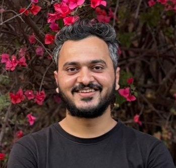

# Ravindra Singh

**PhD Candidate in Geography, Jawaharlal Nehru University**

Spatial justice researcher mapping who gets left out of Delhi's green city agenda

---

## About Me

{ align=right width=200 }

Delhi is officially one of India's greenest cities. It is also a city where millions of residents in informal and unauthorised settlements live without meaningful access to green space, cooling shade, or clean urban environments. This paradox is the starting point of my doctoral research.

I am a PhD candidate at the Centre for the Study of Regional Development (CSRD), Jawaharlal Nehru University, supervised by Professor Milap Punia. My research examines spatial justice in Delhi's urban green infrastructure across three dimensions: who gets the benefits (distributive), who gets a say (procedural), and whose communities are even recognised as legitimate (recognition). My central argument is that misrecognition is foundational — when planning frameworks refuse to acknowledge informal settlements as legitimate urban communities, procedural exclusion and distributive deprivation follow structurally.

My work goes beyond green cover counts and heat metrics. I use geospatial modelling, critical master plan analysis (1962 to 2041), and governance fieldwork in urban villages and unauthorised colonies to examine how Delhi's greening agenda concentrates ecological benefits in planned areas while displacing environmental costs onto the urban poor.

I hold a UGC Senior Research Fellowship and have received competitive funding from Utrecht University, UvA Amsterdam, TU Delft, RWTH Aachen, and the Austrian Student Union. My doctoral research has directly shaped the Shahjahanpur City Heat Action Plan 2026, one of the few instances of PhD-level work translating into a published municipal policy instrument in India.

[Download CV](assets/Ravindra_Singh_CV.pdf){ .md-button }
[View Research](research.md){ .md-button }

---

## Skills

**Geospatial Analysis**
ArcGIS Pro, QGIS, Google Earth Engine, InVEST Urban Cooling Model, remote sensing, spatial regression, hotspot analysis

**Research Methods**
Mixed-method design, governance fieldwork, master plan analysis, community interviews, participatory mapping

**Writing and Communication**
Peer-reviewed book chapters, policy reports, conference presentations, public engagement

---

## Connect

- Email: [01ravindrasingh@gmail.com](mailto:01ravindrasingh@gmail.com)
- GitHub: [github.com/7ravii](https://github.com/7ravii)
- Location: New Delhi, India
